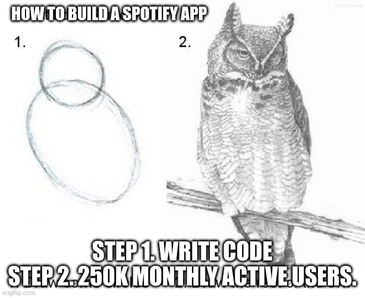
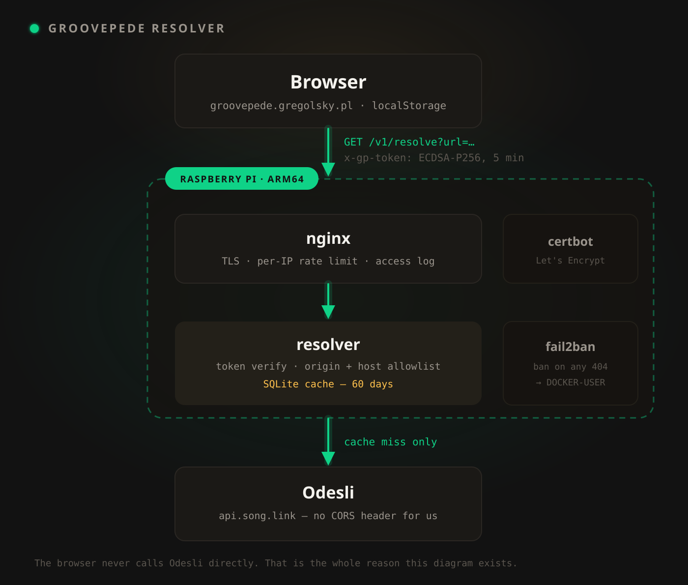

Back in April I wrote about [Groovepede](/posts/groovepede) — a tiny PWA that catches album
recommendations from your phone's share sheet and tags them with genres, so you know what
you're pressing play on. The pitch at the end was "no framework, no backend, no secrets."

Four months and a hundred commits later, two of those three are gone. It has a backend now,
it has secrets, and the backend lives on a Raspberry Pi at my house. Nothing about that was
the plan.

Here's how it happened.

## First it stopped being a Spotify app

The original version was Spotify-only, and that was a bad call from the start. I built a tool
to help me listen more widely, then hard-wired it to one company's catalogue. Someone sends me
an Apple Music link and Groovepede shrugs. I paste a Bandcamp URL and get an error. Worse: you
had to log into Spotify before you could put a single album in your own queue.

There's a second reason, and it's the one that actually settles the argument: **you are not allowed
to ship a free Spotify app.**

A Spotify developer app starts in Development Mode. In Development Mode it serves up to **five**
authenticated users. Not five hundred — five. Each of them has to be added to an allowlist by hand,
by me, using the email on their Spotify account; everybody else gets a 403. The app owner needs an
active Premium subscription or the whole thing stops working. That cap was 25 until February 2026,
which is when it became five.

The way out is Extended Quota Mode. To qualify you need a legally registered business entity, an
active launched service, availability in key Spotify markets, commercial viability, an application
sent from a company email address — and **at least 250,000 monthly active users**.

Read those two paragraphs together. You need a quarter of a million monthly users to be allowed
more than five. And Spotify only accepts applications from organisations, not individuals, so there
is no version of me that qualifies at all. Groovepede could be the best album queue ever written and
it would still be capped at five people, permanently, because I am a person rather than a company.

I'm not the only one who did that arithmetic. When the 250,000-user rule landed in May 2025,
r/truespotify got a thread titled ["Spotify just killed indie development with their new API
restrictions"](https://www.reddit.com/r/truespotify/comments/1l2am4i/spotify_just_killed_indie_development_with_their/),
and the top comment settles the whole thing in one sentence: *"If your app relies on a music
integration how do you get to 250,000 users without a music integration?"* The reply under it:
*"Entry level job that requires 10 years experience kind of situation."*

The saddest part of that thread is its tail. It kept collecting comments for a year afterwards, all
the same shape — *"I spent almost a year building my side project, and now it's just time wasted."*
*"Just finished building something I was so proud of and realized I was under the outdated impression
I could go public with it."* One developer whose app wasn't quite ready before the cutoff signs off
with *"I guess it will be a nice little app for me and 24 other members of my family."* Back then the
cap was 25. I know exactly what that sentence feels like, because that's the app I had — minus
nineteen relatives.

I don't read that as malice — it's a company deciding its API is for partners, not hobbyists, after
a decade of people scraping it. But it does mean the honest description of a Spotify-only Groovepede
is "a thing I built for myself that I am not permitted to give to anyone." That's a lousy thing to
have built.

So in June I tore that out. Groovepede is now a **universal album queue**. Paste a link from
Spotify, Apple Music, YouTube Music, Deezer, Tidal, Amazon Music, Pandora or SoundCloud — the
app resolves it into *every* other service it's available on, and the Listen button opens
**your** app, not the one the link happened to come from. Set your preference once in the
profile; from then on a friend's Tidal link opens in Spotify, or the other way around, without
you thinking about it.

Login is optional now. You can add albums, browse them, filter by genre and hit Listen with no
account at all. Spotify OAuth still exists, but only for one opt-in extra: mirroring your queue into
a private Spotify playlist. It's a connected service, not a gate — and if you're not one of my five
allowlisted users, that one extra is the only thing you don't get.

That said, "optional" is a today statement, not a promise. The resolver currently rate-limits by IP,
which is a blunt instrument on shared networks — if it turns out to be too blunt, the fix is some
form of SSO (Google or otherwise) so limits can key off a user ID instead of an IP. That would make
login the price of heavier use, not the price of entry.

<!-- TODO: add image: current app screenshot — queue view with a couple of albums, genre tag chips, and the "Listen on <service>" button visible -->
<!--  -->

The resolution work is done by [Odesli](https://odesli.co/) — the API behind song.link. Give it
one album URL, get back the same album on every platform that carries it. It's exactly the
service this app needed to exist.

Which brings us to the problem.

## The bug that needed a server

In July I shared two albums into Groovepede from Spotify's native share menu. They landed in the
queue as untitled placeholders and just… sat there. Forever. Every time I opened the app it
would try again, and fail again, silently.

The cause took a while to find, and it's one line:

> `api.song.link` returns `Access-Control-Allow-Origin` only for its own frontends.

So a `fetch` from `groovepede.gregolsky.pl` gets a perfectly good `200` back from Odesli, with
the correct JSON in it — and the browser throws it in the bin because the response carries no
header saying my origin is allowed to read it. My code catches that as a generic network
failure. Network failures are *retryable*. So the app dutifully retried, forever, against a
server that was answering correctly every single time.

The important part: **an API key does not fix this.** CORS is origin-based, not key-based. There
is no amount of authentication that makes a browser read a response the server didn't mark as
readable. The only fix is something that isn't a browser making the call — a server, sitting
between my app and Odesli, re-emitting the response with the right header.

A local-first app with no backend needed a backend. Not for my data — every album still lives in
`localStorage` and nothing about your queue ever leaves your device. Purely to satisfy a rule
about who is allowed to read whose JSON.

## A tour of AWS

I had an AWS account, so that's where it went first: a Lambda behind CloudFront, DynamoDB for the
resolve cache, WAF for rate limiting, plain CloudFormation once I decided SAM was one abstraction
too many.

The one piece I'm still proud of is the auth. Rather than baking a shared secret into a public
JavaScript bundle, requests carry an `x-gp-token` — an ECDSA-P256 signature over a timestamp and
the URL being resolved, valid for five minutes and bound to that one URL. It's honest about what
it is: the private key ships in the public bundle, so a determined person can mint tokens. But a
sniffed token is worth one URL for five minutes, and the real limits are the rate limiter and the
ban rules behind it.

The rest was CloudFormation attrition — a week on the calendar, which in pet-project currency
means a couple of evenings: `ROLLBACK_COMPLETE` states that can't be updated and have to be
deleted, a policy block rejected with `expected type: JSONArray, found: JSONObject` that looks
exactly like the docs, a cert stuck `PENDING_VALIDATION` against a Route 53 record that was
already correct.

One of them I enjoyed, once it stopped hurting. ACM refused to issue with `CAA_ERROR`, and nothing
in my hosted zone or its parent had a CAA record. Except — `groovepede.gregolsky.pl` is a CNAME to
`gregolsky.github.io`, because the app is on GitHub Pages, and CAA lookups follow that. GitHub's
CAA record authorises GitHub's certificate authorities, and Amazon is not on the list. My
*frontend's* hosting provider was refusing to let my *backend* get a certificate. The fix is a CAA
record on the leaf domain naming Amazon, then fifteen minutes waiting for a negative DNS cache to
expire.

It worked in the end. I had a resolver at `api.groovepede.gregolsky.pl` and the two stuck albums
healed themselves on the next refresh.

And then I looked at what I'd actually built: an edge network with global points of presence, a web
application firewall, a managed NoSQL database and autoscaling compute, all in front of one endpoint
whose entire job is to ask a third party "where else can you get this album?" and remember the answer
for sixty days. It serves a few calls a week, most of them from cache. There is no spike coming.

## Then it moved into my house

I had a Raspberry Pi lying around, so the question answered itself: why pay a cloud provider, every
month, for a few calls a week? The Pi is already on and already paid for. Scalable Lambda behind
CloudFront and a WAF was overkill for the actual job; a small self-hosted box is the honest size of
this problem.

The refactor was the interesting part: I pulled everything that mattered — token verification,
the CORS allowlist, the host allowlist against SSRF, the Odesli call itself — into a single
`resolver-core.mjs` with no transport and no storage in it. Then two thin adapters. One is Lambda
plus DynamoDB. The other is `node:http` plus `node:sqlite`, in a Docker Compose stack: resolver,
nginx for TLS and rate limiting, certbot for a free Let's Encrypt cert, fail2ban for the rest.
Same key pair for both, so the app's signed tokens are valid against either backend and switching
is one config line.

Two days after the Pi went live I deleted the AWS deployment from the repo. Lambda, CloudFront,
WAF, the templates, the Makefile — all of it. Git still has it if I'm ever wrong.

Deploys needed their own trick: the Pi sits behind a home router with no inbound SSH, so CI can't
push to it. Instead, deploys are *pulled*. A push to `backend/` publishes to a secret
[ntfy.sh](https://ntfy.sh/) topic — a nice little pub/sub notification service, `curl` a URL and
every subscribed client gets pinged, no account or infra of your own required — a small client on
the Pi picks that up and runs `ansible-pull`. CI then polls `/healthz` until it reports the commit
SHA it just pushed. Polling for `{"ok": true}` would be useless: the *old* build says that too. The
commit is what proves anything landed.

The rest of it I got for free. The cache is a SQLite file I can open. When something breaks I `ssh`
in and read a log instead of correlating across four consoles. And there's no billing surface at
all — no scenario where a scanner finds my endpoint and I learn about it from an invoice.

## Every bug was somewhere other than where it looked

This is the part I want to keep, because I lost the most hours here and every single one went to
the wrong suspect.

**The router that was forwarding fine.** Certbot's HTTP-01 challenge kept coming back
`Connection refused`. Obviously the router wasn't forwarding port 80. I fought the router. Then I
suspected the ISP was blocking it. Neither was true — external nodes on three continents reached
a plain Python server on the same port without complaint. The actual bug was a YAML folded
scalar in `docker-compose.yml`. A `command: >` block folds continuation lines into spaces *only
at matching indentation*; mine were indented deeper, so the newlines survived and the shell saw
three separate commands instead of one. `envsubst` sat reading stdin, and the redirect on the
next "command" truncated nginx's config to zero bytes. nginx started perfectly and served
nothing. My Pi was refusing my own connections.

**The deploy script that destroyed the certificate.** This one never looked broken, which is what
qualifies it. `deploy.sh` checked for a cert, didn't find one the way it expected, and helpfully
bootstrapped a new one — every single deploy, silently: no error, no warning, HTTPS serving fine
the whole time. There was nothing to chase, because nothing looked wrong. Let's Encrypt allows five
duplicate certificates per domain per week; I noticed at four, one deploy away from a week locked
out of issuing anything. Now every deploy backs up the cert first, to the Pi and to my laptop, and
issuance is explicitly opt-in (`--init`) rather than inferred from "looks like there's no cert
here." Guessing is fine for retries. It is not fine for anything rate-limited.

**The bans that banned nothing.** I added fail2ban jails, watched them report bans, and watched
the same scanners keep hitting the server anyway. The obvious read is rotating IPs, or a ban that
hasn't caught up yet — nothing about the symptom points at a rule aimed at traffic that never
passes through it. Docker *published* ports are DNAT'd in `PREROUTING` and traverse `FORWARD`; they
never touch `INPUT`, which is where a stock fail2ban config puts its rules. The jump has to land in
`DOCKER-USER` instead. Fixing that surfaced a second, quieter bug: bans were firing at half the
configured threshold, because my nginx template renders into `conf.d/` — inside the `http` block,
where `access_log` was already declared — so every request was logged twice and fail2ban counted
each 404 twice.

The jail rule itself I like a lot: **ban on any 404.** This server has exactly three valid paths
and an ACME directory. Nothing legitimate ever 404s here, so I don't need a blocklist of scanner
paths that goes stale — anything that misses is hostile by definition.

## Where it is now

Eight services. No login required. Everything still in `localStorage`, still offline-capable,
still no framework. A 1.3 MB production build, down from 12. 300 unit tests, 69 end-to-end tests,
and a smoke suite that runs against production after every deploy — which is the only thing that
would catch the signing key in CI drifting out of sync with the public key on the Pi.

And a Raspberry Pi in my house, quietly answering one question over and over: *where else can I
listen to this?*

[Groovepede](https://groovepede.gregolsky.pl/) is free, needs no account, and installs to your
home screen. Source is on [GitHub](https://github.com/gregolsky/groovepede).
