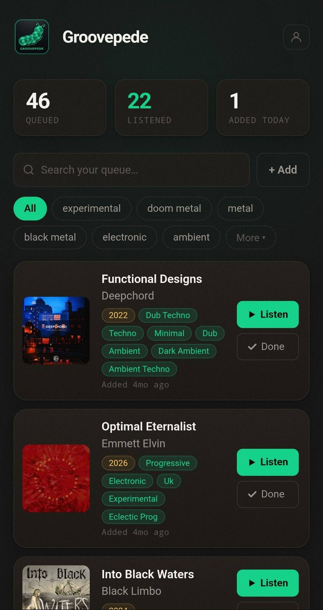

In [Part 2](/posts/groovepede-backend) I moved the Groovepede backend to a Raspberry Pi in my house.
Its job is to find an album on other music services. The Pi did not do that work itself. It asked a
service called [Odesli](https://odesli.co/) and passed the answer on.

Less than two weeks after that post, Odesli closed its free API. This post covers what I changed
after that, and how I got the app into the Google Play Store.

## Replacing Odesli

After Odesli closed, every album I added stayed an empty placeholder. The error message said
*public API access deprecated*.

I found no replacement, so Groovepede now does the lookup itself. The Pi opens the album page you
paste and reads the title, artist and cover from it. Then it searches the other services for the
same album. Groovepede still uses those services. However, no single company can now break the
whole app.

I had to drop two services. Amazon Music and SoundCloud pages stay empty until a browser runs
their JavaScript, so the Pi has nothing to read. **Groovepede now supports six services instead of
eight.**

## Less Spotify

I removed the Spotify login. Its main feature was copying your queue to a Spotify playlist, and
Spotify only lets five approved users use a hobby app like this. I also moved the tracklist to the
Pi, so it now works for every album. I may add a login again one day, for example to sync your
queue between your phone and your laptop.

Then I tried to share *Aeropsia* by *Steve Hauschildt* from the Spotify app. Groovepede said
"Couldn't find an album in that Spotify link." The Spotify app shares a short link inside a
sentence. I added support for the two kinds of short link I knew about, but sharing still failed.
Spotify has a third kind, and my phone was sending exactly that one.

<iframe
  title="Aeropsia by Steve Hauschildt on Spotify"
  src="https://open.spotify.com/embed/album/3dgWhwqZHz4KSUX586c3U4?theme=0"
  width="100%"
  height="352"
  style="border:0;border-radius:12px"
  allow="autoplay; clipboard-write; encrypted-media; fullscreen; picture-in-picture"
  loading="lazy"
></iframe>

*Steve Hauschildt* was one third of *Emeralds*, a synth trio from Cleveland. His solo records are
warm, slowly drifting electronic music. [*Aeropsia*](https://open.spotify.com/album/3dgWhwqZHz4KSUX586c3U4)
came out late last year, and I like it a lot.

## The road to the Play Store

You could always install Groovepede from the browser. Few people do that, though. Most people look
for apps in a store.

Android has a feature for this called a **Trusted Web Activity**. It lets an app open a website in
Chrome, full-screen, without the address bar or tabs. The app gets Chrome's speed and the site's
offline support. There is no separate Android code to maintain. When I update the website, the app
updates too.

The website has to confirm that the app belongs to it. It does this by publishing a small file
with the fingerprint of the app's signing key. Without that file, the address bar stays visible.
This check stops other people from wrapping your site in their own app.

You don't have to write the Android project by hand. Google's
[Bubblewrap](https://github.com/GoogleChromeLabs/bubblewrap) generates it from your site's PWA
manifest. [PWABuilder](https://www.pwabuilder.com/) can do the same from a web page. For Groovepede,
the whole Android setup is one config file.

Google rejected my first uploads a few times, and I fixed each problem. After that, the store
listing was accepted. I still could not publish the app, though.

### Twelve testers, fourteen days

**Google has a rule for personal developer accounts opened after November 2023. Before you can
publish an app to everyone, at least twelve people must join its test and stay in it for fourteen
days in a row.** A tester who leaves early doesn't count. After that, Google reviews the app, which
usually takes up to a week.

I understand the reason. Publishing an app is cheap, and the rule keeps out a lot of spam apps. It
reminds me of Spotify's rule from Part 2, though. Spotify limits a hobby app to five users until it
has *250,000* monthly users. Neither rule fits a person who builds apps in the evenings. Still,
twelve testers is a goal I can reach.

## Where it is now

Groovepede supports six services and needs no login. Your albums are stored only on your device.
The app still uses other companies' services. If one of them shuts down, Groovepede loses a feature
but keeps working.

The Android app is ready, and it needs twelve testers. If you use Android and want to try it,
contact me on [LinkedIn](https://www.linkedin.com/in/gregolsky) or send me an email. I'll add you
to the test.

You can also use [Groovepede](https://groovepede.gregolsky.pl/) in your browser today. It's free,
needs no account, and you can install it to your home screen. The source code is on
[GitHub](https://github.com/gregolsky/groovepede).
