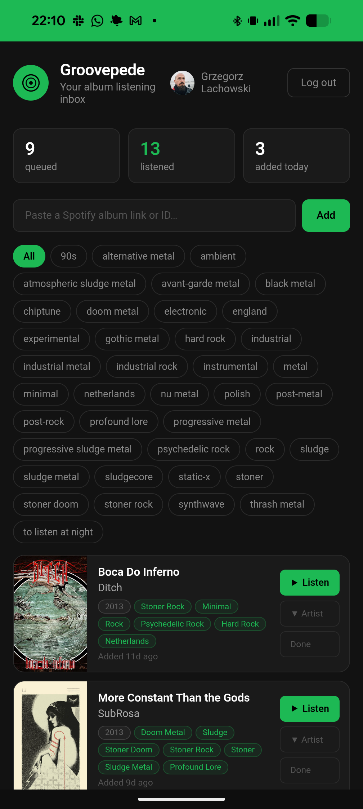

I listen to music in albums. Whole albums, front to back, in the order the artist put them in. If someone sat down and decided track seven comes after track six, that sequencing means something — or at least I want to believe it does. It's an old-school way to listen, and I'm not going to apologize for it.

The other thing about me: I'm a music explorer. Metal, rock, electronica, jazz, ambient, noise, sludge, techno, breakcore, post-punk, drone — I'll try anything. But I don't always have a sweettooth for breakcore. Some mornings want ambient. Some evenings want sludge. What no morning has ever wanted is a surprise wall of harsh black metal before coffee.

## The Spotify Problem

Spotify is great at recommending music and terrible at telling you what the music *is*. You get a cover, an artist name, and a free-text bio if you're lucky. No consistent genre. No tags. And the recommendations rotate daily — a great tip I saw yesterday might be gone by the time I'm in the mood for it tomorrow.

For someone with one or two favorite genres, this is fine. You know your treat. For someone who's bouncing between jazz and noise and techno, it's a guessing game. I'd save albums "for later" and then forget why, or open something expecting downtempo and get blasted with grindcore.

I wanted two things:

1. A place to **park** album recommendations the moment I see them, without breaking flow.
2. A reliable **genre signal** on every album before I press play.

## Enter Groovepede

[Groovepede](https://gregolsky.github.io/groovepede/) is a minimalist PWA that does exactly that.

It installs on your phone and registers itself as a share target. When you're in the Spotify app and you find an album — from a friend's message, a playlist, a radio feature — you tap **Share → Groovepede**. That's it. The album lands in your queue with cover art, artist, release year, and, critically, **Last.fm genre tags**.

Now your queue isn't just a stack of mystery covers. It's a tagged collection you can filter: show me only the ambient I saved, only the jazz, only the doom. Expand any card and you get an artist bio and similar artists pulled from Last.fm — the context Spotify should have given you in the first place. When you listen to an album, you tick it off. Count goes up. Queue stays tidy.

Everything lives in your browser's `localStorage`. Nothing is sent anywhere beyond the Spotify and Last.fm API calls needed to fetch metadata. It works offline after the first load.

## The Tech, Briefly

Groovepede has no framework and no runtime dependencies — Vite handles the dev server and production build. A service worker covers offline support and PWA installability; `localStorage` holds all state. Deployed off GitHub Pages.

Authentication is Spotify's [PKCE OAuth flow](https://developer.spotify.com/documentation/web-api/tutorials/code-pkce-flow), which means no backend, no server, no secrets to store. The app asks for the `user-read-private` scope and nothing else — it doesn't read your listening history, your playlists, or anything else about you. Album metadata comes from the Spotify Web API; genre tags, artist bios, and similar artists come from the [Last.fm API](https://www.last.fm/api).

The JavaScript is split into a handful of focused modules — `api.js`, `app.js`, `auth.js`, `config.js`, `render.js`, `storage.js` — and has grown as features were added. Rendering works the same way it always did: template literals piped into `innerHTML`, one delegated event listener on `document.body`, state in module-level variables. No virtual DOM, no component framework. Code is on [GitHub](https://github.com/gregolsky/groovepede) if you want to poke around or self-host your own instance.

## Try It

If you listen like I listen — albums, wide taste, curious about what a recommendation actually *sounds* like before committing — [open Groovepede](https://gregolsky.github.io/groovepede/), connect your Spotify, add it to your home screen, and start sharing albums into it. Extend your collection without the ambushes. Never lose a good tip to Spotify's recommendation shuffle again.

This is the first of a handful of small PWAs I've been building to smooth out little everyday annoyances. More to come.
