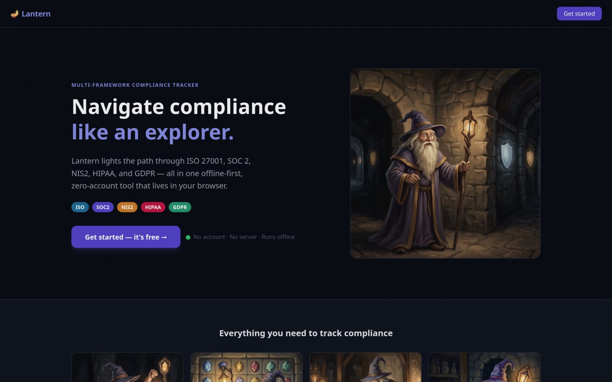
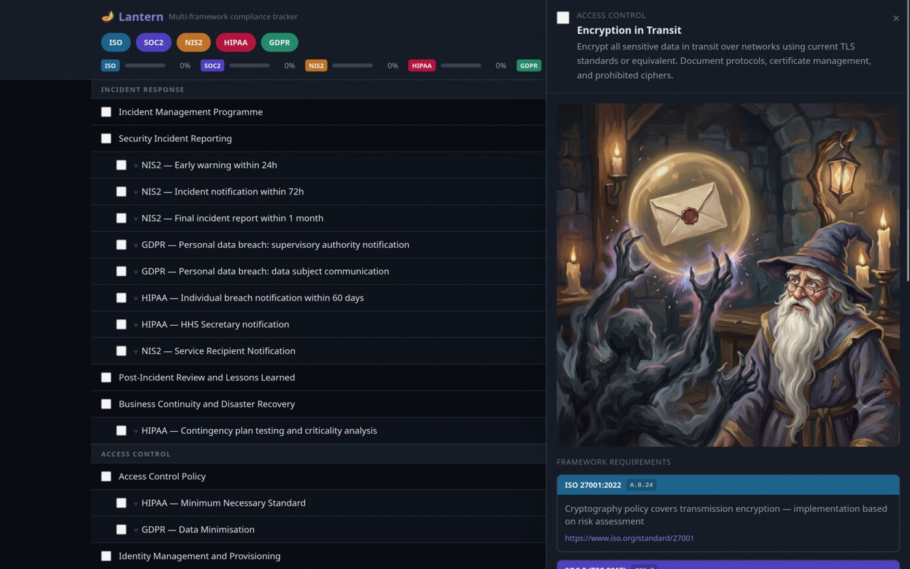

NIS2 has been law for a while. What changed recently is the compliance part - member states
started enforcing, organizations started actually being asked to demonstrate controls, and
suddenly the abstract became very concrete. If you're responsible for security in any
organization that falls under scope, you know the feeling: staring at a list of requirements
and trying to figure out where you already cover them, where you don't, and how that maps
to the framework you're already working in.

Spreadsheets are the usual answer, and honestly they work - up to a point. Once you're
cross-referencing controls across two or three frameworks, tracking notes per requirement,
and trying to see the connections rather than just the list, a flat table starts to fight
you. I wanted something built for that specific job.

## 🏮 What Lantern does

[Lantern](https://gregolsky.pl/lantern/) is a PWA that lets you pick one or more compliance
frameworks - NIS2, ISO 27001, whatever you're working against - and navigate their controls
side by side. For each control you can see references to equivalent controls in other
frameworks, add your own notes, and track where you've made progress. It's a mapper, not
an audit tool. The goal is to close the gap between "we have this framework" and "we
understand how it relates to the one we're being asked about."

No account. No cloud. Everything lives in your browser's `localStorage`. You can export your
state to JSON and import it back - useful for sharing across machines or backing up before
a browser wipe.

## 🧙 The wizard

I didn't want to build another compliance table. Tables are correct and joyless, and staring
at NIS2 Article 21 for the third time in a week is already demoralizing enough without the
UI making it worse.

So Lantern has a wizard. A literal one - a whimsical illustrated character who accompanies
you through the controls. He has opinions about encryption in transit. He takes incident
reporting seriously. He's been around long enough to have seen a few breaches and he'd
rather you hadn't. He doesn't make the content less serious. He makes the experience less grim.

## 🐸 Inspired by Golden Frog Inn

The wizard in Lantern has his own style, but the spirit comes from [@golden_frog_inn](https://www.instagram.com/golden_frog_inn/) -
vast majestic fantasy landscapes, deep forests, old wise wizards on long journeys, painted with the kind of detail
that makes you want to step in. What makes the account special is the captions: they take those epic scenes and
anchor them to the mundane, the relatable, the Tuesday. That contrast - grand and everyday at the same time -
is exactly the energy I wanted in a compliance tool. If you haven't seen it, fix that now.

<blockquote
  class="instagram-media"
  data-instgrm-captioned
  data-instgrm-permalink="https://www.instagram.com/p/DExmq5GoFWr/"
  data-instgrm-version="14"
  style="background:#FFF; border:0; border-radius:3px; box-shadow:0 0 1px 0 rgba(0,0,0,0.5),0 1px 10px 0 rgba(0,0,0,0.15); margin:1px; max-width:540px; min-width:326px; padding:0; width:99.375%; width:-webkit-calc(100% - 2px); width:calc(100% - 2px);">
  <a href="https://www.instagram.com/p/DExmq5GoFWr/">View this post on Instagram</a>
</blockquote>

## Why I built it

The honest answer: I was doing this work in a spreadsheet and hated it. The controls are
interconnected - a single NIS2 requirement often maps to several ISO controls, and the
mapping is rarely 1:1. A flat table doesn't show that well. I wanted something where I
could navigate the structure, keep notes next to the controls they belong to, and not lose
my place when I had to switch context.

Lantern is small. It doesn't pretend to be a GRC platform. It's a focused tool for a
specific, painful part of the job - and it's free, local-first, and doesn't require you
to sign up for anything. And yes, of course you can export it to spreadsheet after all :)

## Try it

The app is at [gregolsky.pl/lantern](https://gregolsky.pl/lantern/). Add it to your home
screen and it works offline. Source is on [GitHub](https://github.com/gregolsky/lantern)
if you want to poke around, add a framework, or run your own instance.

If you're in the middle of NIS2 alignment work, it might save you from the spreadsheet.
