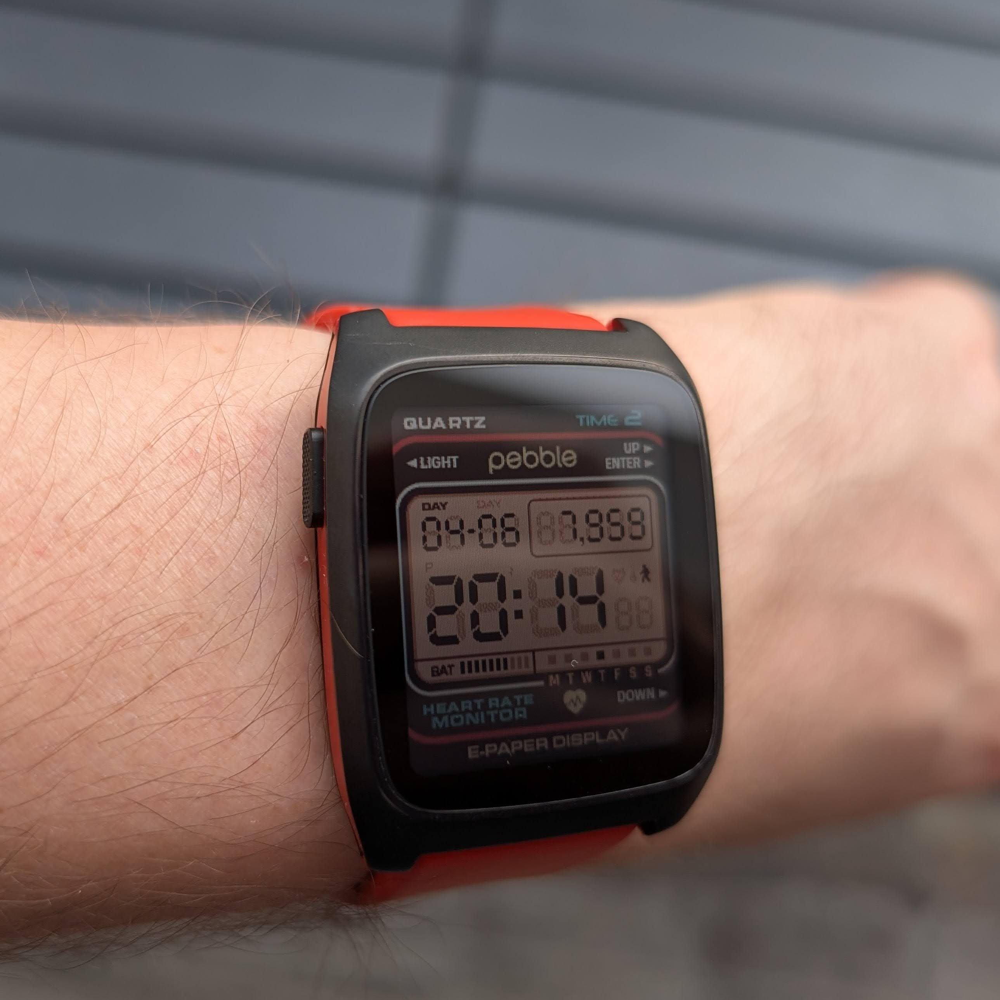
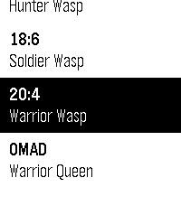
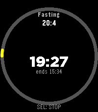

Pebble is back. Against my own better instincts about crowdfunding, I backed the
revival. In March 2025 I put down money for a watch that didn't exist yet, changed
my mind mid-campaign about which model I actually wanted (settling on the Pebble Time 2),
and then waited. And waited. The package finally landed on my desk this week.

It was worth it.

## In case you missed Pebble the first time

If you weren't around for it: Pebble started as a 2012 Kickstarter that, until then,
was the biggest the platform had ever seen — over $10M raised against a $100k goal,
68,000-plus backers, and a clear answer to "what should a smartwatch even be." The
original Pebble shipped a year later: a rectangular e-paper watch with a 7-day
battery, physical buttons, and a simple SDK. It beat the Apple Watch to market by
nearly three years and got the philosophy right where most of the industry got it
wrong — *the watch should know about your phone, not try to be one.*

A 2015 follow-up (the Pebble Time line, including the Pebble Time Steel many of us
still associate with the brand) brought color e-paper and a slimmer chassis. Then in
2016 Fitbit acquired Pebble and quietly turned the lights off. Community servers and
stubborn fans kept the watches alive for years afterward, but the platform itself
was over.

## The years in between

To understand why this watch matters, you have to know what I was wearing before it.
I've been looking for a Pebble-shaped hole-filler ever since the original company
folded, and the search took me through most of the market:

- **Pebble Time Steel.** The benchmark. For years I thought I'd never need another
  watch. Then the ecosystem died, app updates stopped, my battery wore out, and
  one day the thing just stopped charging. Heartbreak.
- **Samsung Gear.** Tried the Tizen route. Awful battery — a day if I was lucky —
  and an interface that wanted to entertain me. Silly animations everywhere.
  Pretty. Useless on the wrist as an actual notification device.
- **Amazfit BIP.** Closer to the Pebble idea on paper: great battery, nice
  always-on display. But no real customization, no app ecosystem, and no
  meaningful interactivity. It's a fitness band wearing a watch costume.
- **Garmin Instinct Solar 2.** Excellent battery, a small but legible display,
  built like a tank. The problem is *the shape of the experience*: it's a chunky
  sports/outdoors device first, and notifications are a clumsy afterthought.
  Reading messages on it is fiddly; clearing them is worse. Great for trails;
  not the daily wrist companion I wanted.

Every one of them got one or two things right and missed the thing that made Pebble
Pebble. So when the revival announcement happened, I knew I wasn't just buying a
watch — I was buying back the *whole posture* the original Pebble had toward your
attention.

## Why Pebble, in 2026

Until Eric Migicovsky — the original founder — pried the Pebble OS source back out
of Google (which had since absorbed Fitbit), open-sourced it, restarted the company,
and put new hardware into production. That's the revival I'm wearing now.

The smartwatch market has spent ten years convincing itself that the wrist is a
phone-shaped opportunity. Apple Watch wants to be a phone. Wear OS wants to be a phone.
Even Garmin keeps growing screens and adding apps. Meanwhile the actual job a watch on
my wrist should do — *tell me what just happened on my phone, without making me reach
for it* — has somehow gotten worse.

Pebble never lost the plot:

- **E-ink, always on.** No tap-to-wake. No tilt-to-wake. No animation. You glance, you
  read, you move on. The screen looks the same in direct sun as it does indoors.
- **Four physical buttons.** I can clear a notification, scroll a message, or trigger
  a watchface action without looking. No swipe gestures, no haptic guessing games.
- **Battery measured in days, not hours.** I charged it once when it arrived and
  haven't thought about it since.
- **Notifications that respect you.** No bouncing animations, no "are you sure",
  no upsell. The text appears, you read it, it goes away.

And then there's the power-user layer. Pebble is the rare smartwatch that *expects*
you to tinker. You can install third-party watchfaces and apps with no curated app-store
gatekeeping. You can wire up arbitrary actions to the buttons. You can even **define
your own vibration patterns** — a custom morse-like cadence for one contact, a different
one for a calendar reminder, a third for your build pipeline. The watch lets you tell
your wrist exactly what it's feeling, without ever looking at the screen. I haven't
seen another consumer smartwatch take that idea seriously.

It's the rare gadget that gets out of your way. Among all the watch OSes I've worn,
this is still the one I trust to actually surface what matters.

*The watchface is [Quartz by Dalpek](https://apps.repebble.com/quartz-by-dalpek_31cfe29ecd814df4b5ca8bb4) — pixel-perfect 80s Casio energy. Exactly the right vibe for this watch.*

## Writing an app for it

A revived platform is only as alive as the things people build for it, so I wanted to
see what development on Pebble actually feels like in 2026. The SDK is open, the
toolchain is C, and the constraints are tight in the way that makes embedded work
genuinely fun — a small screen, limited memory, a handful of physical inputs, no
network unless you really want one.

The app is called **[FastWasp](https://github.com/gregolsky/fast-wasp-pebble)** — a
no-nonsense intermittent fasting tracker that runs entirely on the watch. You pick a
program (12:12, 14:10, 16:8, 18:6, 20:4, OMAD), start a fast, and the watch handles
the rest: it counts down to your eating window, tracks how far past your target you
went if you keep going, buzzes your wrist when you hit milestones, and remembers
enough history to show you total fasts, your average, and your longest streak. No
companion app. No account. No cloud round-trip just to know what time it is. The
whole thing lives on the watch the way it should.

I didn't go in cold. I'd already built a JavaScript PWA version of the same idea —
roughly the same flow, in a browser, on my phone — so by the time I sat down with
the Pebble SDK I knew *exactly* what the app should do, what the screens were, what
the state machine looked like, what the edge cases were (pause, resume, change
program mid-fast, midnight rollover). The Pebble version is the humbler sibling of
the PWA: same skeleton, less surface area, much friendlier glance ergonomics.

Supported on Core 2 Duo, Pebble Time 2, and the original Pebble Time / Time Steel.

## C, fifteen years later, with Claude in the loop

There's a wrinkle to that "I built it" line worth unpacking. I last wrote C at
university, more than fifteen years ago. Day-to-day I work across .NET, Bash, JS, and a handful of other backend stacks — I
can still read C or Python fine, but I don't usually write in them. Sitting down to
write firmware-ish code against a watch SDK should, on paper, have been a multi-week
warmup project before I could even hello-world a UI.

It wasn't. I built FastWasp with Claude in the loop, and the thing that made it work
isn't that the AI "knew C" — it's that I came in with a harness. A `SPECS.md` that
described the app in concrete behavioral terms. A clean separation between the
fasting domain (programs, timers, state transitions) and the Pebble UI layer. SOLID
where SOLID belonged. Unit tests around the pure logic so I could refactor without
fear. CI/CD wired up from commit one. Small, reviewable changes. Conventional
commits. The boring stuff.

That's the punchline I keep coming back to: **the language doesn't matter much when
the harness is right.** What matters is that you have good fundamentals, a clear
picture of what you're building, a spec you can point at, programming principles you
actually apply, tests that hold the line, and a pipeline that catches you when you
slip. Give an AI assistant that scaffolding and it'll happily help you write C on a
watch, or Rust, or anything else. Skip the scaffolding and you'll get a beautiful
pile of confident nonsense in whatever language you prefer.

## Try it

FastWasp is available in the [Pebble app store](https://apps.repebble.com/396b4d6f5a5643f1bcf8dde0). Source on [GitHub](https://github.com/gregolsky/fast-wasp-pebble).
