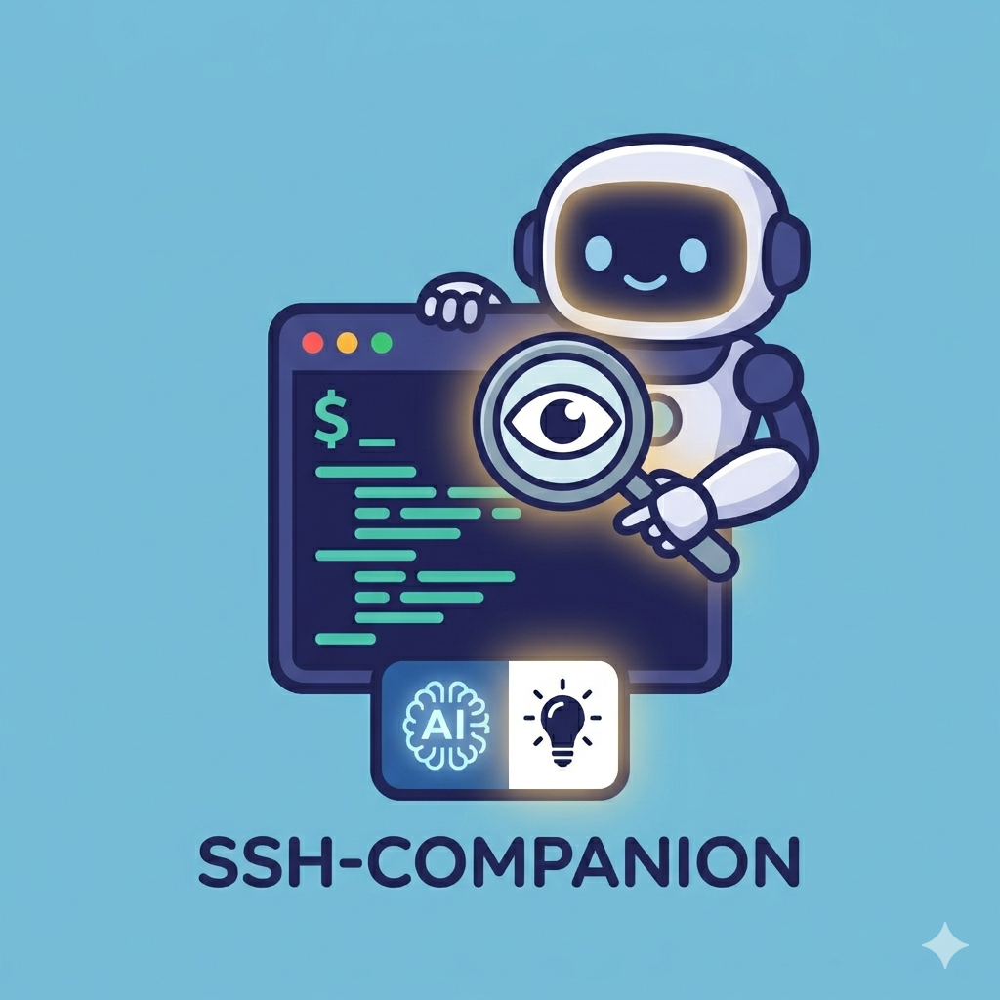
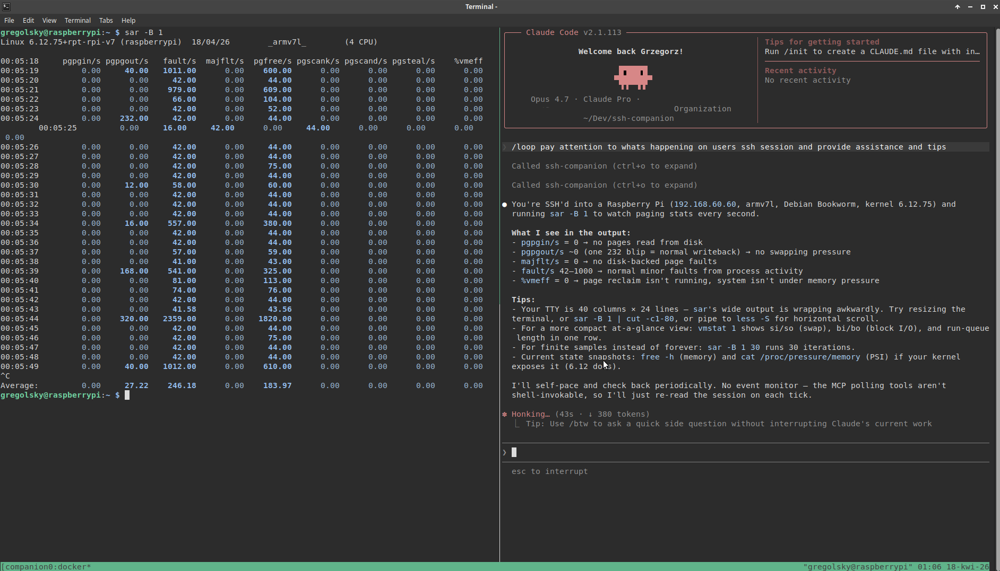

Debugging a remote system at 11pm is a specific kind of loneliness. You're staring at metrics, half-remembering a `sar` flag you used once two years ago, and wishing you had someone who knew this stuff standing behind you going *"try that, no wait — check the iowait first"*.

I built [SSH Companion](https://github.com/gregolsky/ssh-companion) for exactly that feeling.

## What it is

SSH Companion is a small MCP server that wraps your SSH session and lets Claude watch the terminal output in real time. It can advise you, remind you of commands you use once a year, explain what something means, or just confirm that yes, that swap usage does look suspicious. What it cannot do is type anything. It has no write access. It watches.

This matters. You stay in control of the keyboard. Claude stays in the role it's actually good at: pattern recognition, recall, and commentary. The session is yours. The wingman is just over your shoulder.

<!-- TODO: add image: logo/icon from the ssh-companion repo -->


## How it works

The plumbing is simple but clever. Your SSH session is wrapped with `script` — a Unix utility that records everything printed to a terminal into a file, like a flight recorder for your shell session. The MCP server tails that transcript, strips the ANSI escape codes, and feeds the clean text to Claude via stdio. Claude sees exactly what you see, minus the colors.

The container runs unprivileged — `--cap-drop=ALL`, no new privileges. It can see your session log. It cannot reach anything else.

One caveat worth repeating from the README: don't `cat` your secrets. If you pipe a `.env` file to the terminal, Claude will read it. That's the deal you make when you put an AI observer on your session. The security model is about the container, not about what you type.

## tmux makes it actually nice

The whole thing launches in [tmux](https://github.com/tmux/tmux/wiki) on Linux — arguably the most underrated tool in any Unix workflow. One command splits your terminal: SSH session on the left, Claude Code on the right, watching the same transcript. If you haven't spent serious time with tmux, this project is a decent excuse to start. It turns a single terminal into a proper workspace, with panes, sessions, and keyboard-driven navigation that becomes muscle memory fast. On Windows, SSH Companion uses Windows Terminal with separate panes instead — same idea, different plumbing. The launch scripts cover both: `companion.sh` for bash, `companion.ps1` for PowerShell.

<!-- TODO: add image: screenshot from the ssh-companion repo (screenshots/1.png) -->


## The performance skill

SSH Companion ships with a built-in performance debugging skill. When you invoke it, Claude starts with Brendan Gregg's [Linux Performance in 60 Seconds](https://www.brendangregg.com/Articles/Netflix_Linux_Perf_Analysis_60s.pdf) checklist — the canonical first pass any experienced sysadmin runs when a system is misbehaving. Uptime, dmesg, vmstat, mpstat, iostat, free, sar, top. The ten commands that tell you where to look next.

Brendan Gregg is the performance engineer's performance engineer — the person who wrote the book on Linux systems observability (literally). Having his checklist as the entry point is not an accident. It's a good default because it's the right default.

## Try it

```bash
# launch SSH session with your AI wingman
./companion.sh ssh user@yourserver
```

The repo is at [github.com/gregolsky/ssh-companion](https://github.com/gregolsky/ssh-companion). You'll need Docker, tmux, and Claude Code CLI. The README walks through the setup — it's a few steps but nothing exotic.

If you've ever wished you had a senior sysadmin watching your back on a tricky production box, this is close enough.
